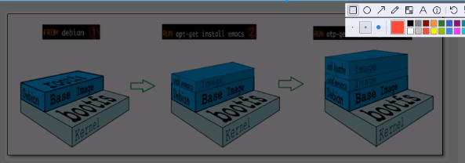

# Docker

笔记：https://blog.csdn.net/qq_21197507/article/details/115071715

## 基本概念

当我们发布一个项目的时候，可不可以**带上环境一起进行打包**呢，这样的话就可以保证项目在任何环境中都可以运行（从windows到docker）。Docker可以将操作系统，运行时环境，第三方软件库和依赖包，以及环境变量，配置文件，启动命令等通通打包在一起，以便在任何环境中都可以正确地运行。那么只要在开发环境中运行成功了，那么在测试环境以及生产环境一定也是运行成功的。

传统：开发人员准备jar，运维来部署

现在：开发人员打包部署上线，一套流程做完。DevOps（开发运维）

Docker 的思想就来自于集装箱

JRE --- 多个应用（端口冲突）---说明应用之间原来都是交叉的！

现在要隔离起来：Docker的核心思想，就是打包装箱！---每个箱子都是互相隔离的。 再也不用担心应用端口冲突问题了。

Docker通过隔离机制，可以将服务器利用到极致。


## Docker的历史

2010年，几个搞IT的年轻人，在美国成立里一家dotcloud！

做一些pass的云计算服务。 有关的容器技术！

他们将自己的技术命名就是Docker！

Docker刚刚诞生的时候，没有引起行业的注意！就经营不下去！

2013年就开始开源---开放源代码！将所有的代码公布出去！

那么越来越多的人发现了docker的优点！就火了！之后几乎每个月都更新一个版本！

2014年 Docker 1.0发布！

Docker为什么这么火？相对虚拟机十分的轻巧。在容器技术出来之前，我们都是使用的虚拟机技术。

## Docker和虚拟机的区别

### 虚拟机

Vmware，Virtalbox，Parallels desktop等虚拟机，是将一台物理服务器虚拟化称为多台虚拟化的服务器，每个逻辑服务器都有自己的操作系统，CPU，内存，硬盘，网络接口等，他们之间是完全隔离的，可以独立运行。不过缺点也很明显，每台虚拟机都需要占用大量的资源，而大部分情况下，其实我们的一台服务器上只需要运行一个主要对外提供服务的应用程序就可以了，并不需要一个完成的操作系统，所提供的所有功能，导致了资源的浪费。

### 容器和虚拟机的区别

Docker只是容器的一种实现，是一个容器化的解决方案和平台。而容器是一种虚拟化技术，和虚拟机类似，也是一个独立的环境，可以在这个环境中运行应用程序，和虚拟机不同的是，它并**不需要在容器中运行一个完整的操作系统**，而是使用**宿主机的操作系统**，所以启动速度非常快。同时因为运行需要的资源更少，所以在一台物理服务器上可以运行更多的容器。


### 基本概念

Docker 是基于Go语言开发的开源项目。

官网： https://www.docker.com/

文档地址：https://docs.docker.com/  Docker的文档是超详细的。

## 镜像image：

> 是一个只读的模板，可以用来创建容器服务，容器是docker的运行的一个实例，它提供了一个独立的可移植的环境。可以在这个环境中运行应用程序。镜像和容器的关系，就像类和实例的关系一样，容器就是这个模板的一个实例，可以有一个，也可以有多个。

仓库repository：

> Docker 仓库： 是用来存储docker镜像的地方，最流行的仓库就是DockerHub

Docker 是使用Client-Server架构模式，Docker Client和Docker Daemon之间通过Socket或者RESTful API进行通信，Docker Daemon就是服务端的守护进程，他负责管理Docker的各种资源。Docker Client负责向Docker Daemon发送请求，Docker Daemon接收请求之后进行处理，然后将结果返回给Docker Client，这里的Docker Daemon是一个后台进程，所以我们在终端中输入的各种Docker 命令，实际上都是通过Docker客户端发送给Docker Daemon的。然后Docker Daemon再进行处理，最后再将结果返回给客户端。然后就可以在终端中看到执行结果了。


## 安装配置

使用以下命令查看Linux系统的信息

```
cat /etc/os-release

//the info about the linux system.
NAME="CentOS Linux"
VERSION="7 (Core)"
ID="centos"
ID_LIKE="rhel fedora"
VERSION_ID="7"
PRETTY_NAME="CentOS Linux 7 (Core)"
ANSI_COLOR="0;31"
CPE_NAME="cpe:/o:centos:centos:7"
HOME_URL="https://www.centos.org/"
BUG_REPORT_URL="https://bugs.centos.org/"

CENTOS_MANTISBT_PROJECT="CentOS-7"
CENTOS_MANTISBT_PROJECT_VERSION="7"
REDHAT_SUPPORT_PRODUCT="centos"
REDHAT_SUPPORT_PRODUCT_VERSION="7"
```

## Install

在Linux系统中依据以下手册进行安装

https://docs.docker.com/engine/install/centos/

```
[root@Newaim-SMG01 ~]# systemctl start docker
[root@Newaim-SMG01 ~]# docker version

 var/lib/docker docker的默认工作路径
```

## 回顾Run流程和Docker原理？？？

```
docker run hello-world
```


Docker Engine 是一个客户端-服务器应用程序，具有以下主要组件：

- 一个服务器，他是一种长期运行的程序，称为守护进程。运行在主机上，通过Socket从客户端访问
- DockerServer 接收到Docker Client的指令，就会执行这个命令

### Docker常用命令

#### 帮助命令

```
docker version
docker info
docker 命令 --help
```

帮助文档: https://docs.docker.com/engine/reference/commandline

#### 镜像命令

**docker images** 查看所有本地的主机上的镜像

```
[root@Newaim-SMG01 ~]# docker images
REPOSITORY    TAG       IMAGE ID       CREATED         SIZE
return        latest    e28edeb325b9   46 hours ago    60MB
hello-world   latest    d2c94e258dcb   12 months ago   13.3kB

```

**docker search** 搜索镜像

```
docker search mysql[:tag]

通过收藏过滤,收藏大于3000
--filer=START=3000
```

**docker pull** 下载镜像

```
docker pull mysql
如果不写tag，默认就是最新版的，指定版本命令如下
docker pull mysql:5.7
```

**docker remove** 删除镜像

```
docker rmi -f e73346bdf465（镜像id） #删除指定的镜像
# 是rmi 是remove image的缩写
# -f 是force的意思，强制删除镜像
```

#### 容器命令

**说明**：我们有了镜像才可以创建容器，我们下载一个linux发行版centos镜像测试学习。

```
docker pull centos #下载centos
docker images #查看
```

**新建容器并启动**

```
docker run -it centos /bin/bash
docker run [可选参数] images
```

>### 常用参数说明
>
>**-d, --detach**
>
>分离的意思，在后台运行容器并返回容器ID。
>
>**-it**
>
>- **-i, --interactive**：保持标准输入打开（用于交互式会话）。
>- **-t, --tty**：分配一个伪终端。
>
>**--name**
>
>- **作用**：为容器指定一个名称。
>
>**-p, --publish**
>
>- **作用**：将容器的端口映射到主机的端口。
>
>**-v, --volume**
>
>- **作用**：绑定挂载一个卷。
>
>**--rm**
>
>- **作用**：在容器停止后自动删除容器。
>
>**-e, --env**
>
>- **作用**：设置环境变量。
>
>**--network**
>
>- **作用**：指定容器连接的网络。

```
docker run -d -p 8080:80 --name my-nginx -v /my/local/content:/usr/share/nginx/html -e NGINX_HOST=myhost -e NGINX_PORT=80 nginx
```

解释：

- `-d`：在后台运行容器。如果你不使用 `-d`，容器会在前台运行，并将其输出直接显示在当前的终端上。让其在后台运行，不会阻塞终端。这样的话，你可以继续在终端执行其他命令，而容器在后台继续运行。
- `-p 8080:80`：将主机的 8080 端口映射到容器的 80 端口。先主-后容
- `--name my-nginx`：为容器指定名称 `my-nginx`
- `-v /my/local/content:/usr/share/nginx/html`：将主机的目录 `/my/local/content` 挂载到容器的 `/usr/share/nginx/html` 目录。先主-后容
- `-e NGINX_HOST=myhost` 和 `-e NGINX_PORT=80`：设置环境变量 `NGINX_HOST` 和 `NGINX_PORT`。
- `nginx`：使用 `nginx` 镜像。

通过这些参数，你可以灵活地控制容器的行为和配置。

**列出所有的运行的容器**


```
docker ps   --which shows running processes.
```

**退出容器**

```
exit 直接容器停止并退出
ctrl+P+Q 容器不停止退出
```

**删除容器**

```
docker rm 容器id ，不能删除正在运行的容器
docker rm -f 删除所有的容器
```

启动和停止容器的操作

```
docker start 容器id
docker restart 容器id
docker stop 容器id
docker kill 容器id  #强制停止当前容器
```

**后台启动容器**


进入当前正在运行的容器

```
docker exec -it 容器id /bin/bash  （进入容器后开启一个新的终端，可以在里面操作，常用）
docker attach 容器id   （进入容器正在执行的终端，不会启动新的进程）
```

**从容器内拷贝到主机上**

```
docker cp 容器id：容器内路径 目的地主机路径
将文件copy到主机上
docker cp b8453025116：home/test.jave /home
```


**部署Nginx**

```
# pull the images
docker pull nginx
# 将容器的80端口，映射给宿主机3344端口，这意味着你可以通过访问主机的3344端口来访问容器中运行的 Nginx 服务
docker run -d --name nginx01 -p 3344:80 nginx (将容器内80端口，映射给服务器3344端口)
# check docker contianer
docker ps
# 访问服务器3344端口，本机自测
curl localhost:3344

进入容器
查看nginx内部配置文件
```

思考问题：我们每次改动nginx配置文件，都需要进入容器内部，十分麻烦，我要是可以在容器外部提供一个映射路径，使容器内部就可以自动修改? -v 数据卷。

**部署Tomcat**

```
# docker run也会自动帮我们下载
docker run -it --rm tomcatL9.0
# 我们之前的启动都是后台，停止了容器之后，容器还是可以查到， 以上一般用来测试，用完就删除 docker run -it --rm，不建议这么用

docker pull tomcat
docker pull tomcat:9.0
# start tomcat
docker run -d -p 3355:8080 --name tomcat01 tomcat
# 进入容器，发现 1，Linux命令少了，2 没有webapps。 因为镜像原因，默认为最小的镜像，所有不必要的都剔除掉，保证最小化可用。
docker exec -it tomcat01 /bin/bash

```

思考问题：如果以后要部署项目，如果每次都进入容器是不是十分麻烦，我要是可以在容器外部提供一个映射路径，让我们在可以在外部放置项目就自动同步到内部，这样就是一个很好的方案。

**可视化**

- portainer可视化面板安装

  什么是portainer，是docker图形化界面管理工具，提供一个后台面板供我们操作。

  ```
  docker run -d -p 8088:9000 \
  --restart=always -v /var/run/docker.sock:/var/run/docker.sock --privileged=true portainer/portainer
  ```

  访问测试：外网： 8088

  可视化面板我们平时不会使用，大家自己测试玩玩即可。

# Docker 镜像讲解

镜像是一种轻量级，可执行的独立软件包，用来打包运行环境和基于运行环境开发的软件，它包含运行某个软件所需要的所有内容，包括代码、运行时，库，环境变量和配置文件。

所有的应用，直接打包成docker镜像，就可以直接跑起来。

如何得到镜像：

从远程仓库下载

朋友copy给你

自己制作一个镜像Docker File

## 镜像原理之联合文件系统

- Docker 镜像采用了分层的设计，每一层都包含了文件系统的一部分，而这些层通过 UnionFS 进行联合。当你创建一个新的镜像时，Docker 会在现有的镜像基础上创建一个新的容器层，该容器层与之前的层通过 UnionFS 进行联合，形成一个新的镜像。

- 通过这种分层的设计，Docker 镜像可以实现高效的复用和共享。如果两个镜像都使用了相同的基础镜像，那么它们会共享相同的基础层，而不需要重复存储相同的文件。这样可以节省存储空间，并且加快镜像的下载和部署速度。

- 比如我们分别拉取了镜像Centos，MySql以及Mongodb，假如Mysql和Mongdb都是运行在Centos上面，那么我们只需要一个Centos就可以了。

  

  

## commit 镜像

如何自己提交一个镜像

```
docker commit 提交容器称为一个新的副本镜像

#命令和git原理类似
docker commit -m="提交的描述信息" -a="作者" 容器id 目标镜像名：[TAG]
```

实战测试

```
1.启动一个默认的tomcat
2.发现这个默认的tomcat是没有webapps应用，官方的镜像默认webapps下面是没有文件的。
3.我自己拷贝进了文本文件
4.然后将修改过的容器提交为一个新的镜像，这样我们就可以直接使用我们修改过的镜像即可。
docker commit -m='' -a='' 7e119b82cff6 tomcat02:1.0
这样repository里面就有一个名为tomcat02，TAG为1.0的镜像。
```

## 容器数据卷

数据如果也存在容器当中，那么容器删除，数据就会丢失了，那么我们需求数据可以持久化。

比如MySQL，容器删了，删库跑路，需求：MySQL数据可以存储在本地！

容器之间可以有一个数据共享的技术，Docker容器中产生的数据，同步到本地。

这就是卷技术，目录的挂载，将我们容器内的目录，挂载到Linux上面。

总结：容器的持久化和同步操作！容器间也是可以数据共享的。

### 使用数据卷

```
docker run -it -v 主机目录：容器内目录 images /bin/bash

docker run -it -v /home/ceshi:/home centos /bin/bash
ceshi 是linux上文件夹， /home是docker容器中文件夹，二者文件夹内容的是同步的。

docker inspect 容器id
查看容器挂载的详细信息
```

### 实战：安装MySQL

思考：MySQL的数据持久化的问题


### 具名和匿名挂载

将挂载的卷命名就是具名挂载，否则就是匿名挂载，他们不需要宿主机路径，会有一个默认路径。


查看卷volume的具体位置


 如何确定是具名挂载还是匿名挂载，还是指定路径挂载呢？

```
-v 容器内路径   #匿名挂载
-v 卷名:容器内路径  #具名挂载
-v /宿主机路径::容器内路径  #指定挂载路径
通过 -v 容器内路径:ro rw 改变读写权限
ro readonly #只读
rw readwrite #可读可写

docker run -d -P --name nginx02 -v juming-nginx:/etc/nginx/:ro nginx
docker run -d -P --name nginx02 -v juming-nginx:etc/nginx:rw nginx
只要看到ro 就说明路径只能通过宿主机改变，容器内是无法操作的。
```

# 初识Dockerfile

Dockerfile 就是用来构建docker镜像的构建文件，是一个命令脚本，先体验一下，通过这个脚本可以生成镜像。

镜像是一层一层的，脚本是一个个命令，每个命令是一层

```
# 创建一个dockerfile文件，名字可以随机，建议Dockerfile
# 文件中的内容， 指令(大写) 参数
FROM centos

VOLUME ["volume01","volume02"] //匿名挂载，默认挂载到宿主机

CMD echo "----end----"

CMD /bin/bash

# 这里的每个命令，就是镜像的一层
```

 这种方式我们未来使用的十分多，因为我们通常会构建自己的镜像！

## 数据卷容器


容器之间实现数据同步。

```
--volumes-from
相当于 子继承父，那么父镜像中挂载的数据卷，在儿子中都是同步和共享的。
测试：可以删除docker01，查看docker02和docker03，看看是否还是可以访问呢
是可以访问的，相当于一种备份机制。

这也就是说，多个mysql实现数据共享
```

结论：

容器之间配置信息的传递，数据卷生命周期一直持续到没有容器使用位置。但是一旦你持久化到了本地，这个时候本地的数据是不会删除的。

## 构建images步骤

```
编写一个dockerfile 文件
进入项目目录，然后开始构建镜像
docker build 构建成镜像
docker run 运行镜像
docker push 发布镜像（DockerHub）
```

## 构建镜像

### 基础知识

```
1.每个保留关键字都是必须大写字母
2.#表注释
3.从上到下顺序执行
4.每一个指令都会创建一个新的镜像层，并提交
```

dockerfile是面向开发，我们以后要发布项目，做镜像，就需要编写dockerfile文件，这个文件十分简单。docker镜像逐渐称为企业交付的标准，必须要掌握。

## 指令说明

```
FROM        # 基础镜像 一切从这里开始构建 centos
MAINTAINER  # 镜像是谁写的，姓名+邮箱
RUN         # 镜像构建时需要执行的一些命令
ADD         # 比如说我想搭建里面有tomcat的容器，比如在centos上面添加tomcat
WORKDIR     # 镜像的当前工作目录
VOLUME      # 挂载的目录
EXPOST      # 保留端口的位置
CMD         # 指定这个容器启动的时候要运行的命令，只有最后一个会生效，可被替代
ENTRYPOINT  # 指定这个容器启动的时候要运行的命令，可以追加命令
ONBUILID    # 刚构建一个被继承的DockerFile 这个时候就会运行ONBUILD 的指令，触发指令
COPY        # 类似ADD，将我们文件拷贝到镜像中
ENV         # 构建的时候设置环境变量
```

### 实战测试

Docker Hub 中99%的镜像都是从scratch开始的，然后配置需要的软件和配置进行进一步的构建。

### 发布自己的镜像

```
#DockerHub
```

确定账号可以登录，在我们服务器行提交自己的镜像。

### Docker所有流程小结 


# Dokcer网络

网络接口（大楼地址）：每个服务器（计算机）可以有一个或多个网络接口（IP地址），这些接口将服务器连接到不同的网络（类似于大楼可以有多个入口，每个入口都连接到不同的街道或区域，以及其他的小区大楼）。

服务端口（住户地址）：每个网络接口可以提供多个服务，每个服务在一个特定的端口上运行。端口号就像门牌号，标识了具体的服务，所以所有进来这个小区的网络，都可以获取到同样的服务。

如果小区有多个网络接口，并且每个接口绑定了不同的 IP 地址，则每个接口上的每个 IP 地址都可以独立监听不同的端口。

**示例**： 假设设备 B 有两个接口(例如两个网卡)：每个网络接口都可以配置一个不同的 IP 地址

- 有线接口（IP 地址：192.168.1.10）。
- 无线接口（IP 地址：192.168.1.11）。

设备上的 Web 服务器可以同时在这两个接口上运行：

- `192.168.1.10:80`（有线网络上的 HTTP 服务）。
- `192.168.1.11:80`（无线网络上的 HTTP 服务）。

​    HTTP服务通常使用端口 80
​    HTTPS服务通常使用端口 443
​    SSH服务通常使用端口 22， MySQL服务通常使用端口 3306

>我们发现这个容器带来的网卡，都是一对对儿的。
>
>veth-pair 就是一堆的虚拟设备接口，他们都是成对出现的，一端连着协议，一段彼此相连。
>
>正因为有这个特性，veth-pair充当一个桥梁，连接各种虚拟网络设备
>
>Docker容器之间的连接，OVS，OpenStac的连接都是使用veth-pair技术


结论：容器之间通过ip地址是可以相互ping通的。

### 1. **默认桥接网络 (`docker0`)**

- 当你在 Docker 中启动一个容器而没有指定网络时，Docker 默认会将该容器连接到一个叫做 `docker0` 的桥接网络。
- 在这个网络中，Docker 会为每个容器分配一个唯一的 私有IP 地址，这些 IP 地址在容器间可以相互访问, **私有 IP 地址** 是专门用于**局域网**通信的 IP 地址，不会直接出现在互联网上.

### 2. **容器的 IP 地址分配**

- Docker 为每个容器分配一个私有 IP 地址，通常是基于 Docker 守护进程管理的子网（默认是 172.17.0.0/16）。
- 使用 `docker inspect 容器名称/容器ID` 可以查看该容器的 IP 地址。

### 3. **容器之间的通信**

- 由于所有容器都在 `docker0` 虚拟网桥下，它们之间的网络通信通过这个虚拟网桥转发，默认情况下，容器间可以相互 ping 通。

### 4. **容器删除后网络行为**

- 每当你删除一个容器时，该容器的网络接口和对应的 IP 地址会被自动移除，容器再启动时会重新分配一个新的 IP 地址。
- Docker 不会保留这些 IP 地址，因为默认情况下它不需要持久化这些 IP。

### 5. **持久化网络设置（用户定义网络）**

- 如果你想确保容器之间的 IP 地址或者网络拓扑不会随容器删除而改变，可以创建一个**用户定义的桥接网络**。
- 使用自定义网络的好处是：
  - 可以为容器设置固定 IP 地址。
  - 容器名称会自动解析为 IP 地址，简化容器间的通信。

## Link

>思考一个场景，我们编写另一个微服务，database url=ip；如果项目不重启，数据库ip换掉了，我们希望可以处理这个问题，可以按名字来进行访问容器。
>
>本质探究：--link就是我们在hosts配置中增加了一个id配置。不过我们现在玩Docker已经不建议使用--link了！
>
>我们需要使用的是自定义网络，而不是使用Docker0, 因为它不支持容器名链接访问。

## 自定义网络

Docker 容器互联是指在 Docker 环境中，多个容器之间通过网络进行通信和数据交换的能力。它允许不同的容器相互连接和交互，使得分布式应用和微服务架构更加容易实现。

```
docker network ls
# 查看所有的docker网络
```

网络模式：

- bridge 桥接模式，桥接网络是 Docker 的默认网络模式，也就是上面的docker0，当 Docker 在宿主机上安装时，它会自动创建一个名为 `docker0` 的虚拟网桥（virtual bridge），它**为容器之间的通信提供了一个虚拟网络环境**。通过这个桥接网络，**Docker 容器可以相互通信**并与宿主机进行数据交换。每次启动一个容器，Docker 都会在这个桥接网络上分配一个 IP 地址给容器。不同容器可以通过这个网络相互通信。
- none  就是不配置网络，一般不会用。
- host 和宿主机共享网络：在主机网络模式下，容器共享宿主机的网络命名空间，直接使用宿主机的 IP 地址和端口。这种模式适用于需要高性能网络通信的场景，但会带来端口冲突问题。
- container 容器内网络联通，用的少，局限很大。
- **Overlay 网络模式**：用于跨多个 Docker 主机进行容器间通信，常用于 Docker Swarm 或 Kubernetes 等集群环境。

```
docker network create --driver bridge --subnet 192.168.0.0/16 --gateway 192.168.0.1 mynet
```

### 命令解释

- `docker network create`: 创建一个新的 Docker 网络。
- `--driver bridge`: 指定网络驱动类型为桥接（默认类型）。
- `--subnet 192.168.0.0/16`: 指定新的docker网络的子网范围。
- `--gateway 192.168.0.1`: 指定网络的网关。
- `mynet`: 自定义网络的名称

假设我们有一个子网 `192.168.0.0/16`，在这个子网内，子网是一个 IP 地址范围，表示在这个网络中可用的 IP 地址集合。子网通过将一个大的网络划分为更小的网络段，帮助更好地管理和组织网络，提高性能和安全性：

它可以拆解为两个部分来理解：

1. **`192.168.0.0`**：这是网络的起始 IP 地址，表示该子网的网络部分。

2. **`/16`**：这是子网掩码的长度，表示前 16 位用来表示网络部分，剩下的 16 位用来表示主机部分。总共32位，255.255.255.255, 一个255是8位二级制数。

3. ### 具体解释

   - **网络部分**：`/16` 表示子网掩码有 16 位为 `1`，即 `255.255.0.0`，这意味着 `192.168.x.x` 的前 16 位（即 `192.168`）是网络部分，标识网络。
   - **主机部分**：剩余的 16 位是主机部分，因此该网络中有 2^16 = 65,536 个可用的 IP 地址，可以用于主机（计算机、服务器、路由器等）。

- **网络地址（192.168.0.0）**：标识整个子网，相当于小区的名字“绿色花园小区”。

- **广播地址（192.168.255.255）**：用于向子网内所有设备发送广播消息，相当于小区的公告板或喇叭广播。

- **网关地址（192.168.0.1）**：子网内设备与外部通信的出入口，相当于小区的大门。当用户需要访问互联网或接收外部数据时，它们会通过网关发送和接收信息。

- **普通IP地址（192.168.0.2）**：分配给网络中的某个设备，相当于小区中的2号房，住着某一户家庭（一个docker）。

- 通常情况下，家庭和小型办公网络使用的子网掩码是 `/24`（即 `255.255.255.0`），而 `/16` 子网更常见于较大的网络，如企业级网络中。

  ## 网段和子网：

- **一个网段内的设备可以通信**，这是指设备在同一个 **子网**（或子网段）中时，彼此之间可以通过 **交换机** 等网络设备直接通信。而 **不同子网** 之间的通信，即使在同一个网段中，通常也需要通过 **路由器** 来进行，因为路由器负责处理 **子网间的流量**。

  #### 1. **同一子网内的通信**：

  当设备位于同一子网时，通信通过 **二层网络设备**（如交换机或集线器）来完成。二层设备工作在 **数据链路层**，通过 **MAC 地址** 转发数据帧。子网中的设备可以直接通信，因为它们的 IP 地址和子网掩码会让设备知道彼此位于同一子网内，不需要进一步的路由。

  - **例子**：如果两个设备的 IP 地址分别是 `192.168.1.10` 和 `192.168.1.20`，子网掩码是 `255.255.255.0`，它们都在同一个子网 `192.168.1.0/24` 中，可以直接相互通信。

  #### 2. **不同子网之间的通信**：

  当设备位于 **不同子网** 时，尽管它们可能属于同一个 **大网段**（例如 `192.168.0.0/16`），但仍然需要路由器，因为：

  - **IP 地址和子网掩码** 不匹配，使得设备无法通过简单的二层通信直接访问其他子网的设备。
  - 每个子网的设备认为属于不同的网络区域，需要路由器来决定如何把数据包转发到目标子网。

  **路由器** 是三层设备，工作在 **网络层**，负责处理跨子网的通信。它会查看数据包的 **IP 地址**，决定通过哪个接口或路径将数据发送到目标子网。这是三层网络结构的核心功能。

  - **例子**：如果一个设备在 `192.168.1.10/24`，另一个设备在 `192.168.2.10/24`，它们处于不同的子网中（尽管都在 `192.168.0.0/16` 大网段内）。它们之间的通信需要经过路由器，以便决定如何从 `192.168.1.0/24` 子网转发到 `192.168.2.0/24` 子网。

  #### 3. **网段 vs 子网**：

  - **网段**：是一个较大的 IP 地址范围，比如 `192.168.0.0/16`，包含多个子网。
  - **子网**：是网段的细分部分，比如 `192.168.1.0/24` 和 `192.168.2.0/24` 是两个不同的子网。

  虽然这两个子网都属于同一个网段，但它们的 IP 地址在不同的子网范围中，因此需要路由器来实现跨子网的通信。

  ### 总结：

  - **同一子网内** 的设备可以直接通信，不需要路由器。
  - **不同子网** 之间，即使它们属于同一网段，通信需要路由器来进行跨子网转发。这是因为不同子网的设备被认为是位于不同的网络区域，二层设备（如交换机）无法处理跨子网的通信。

### 验证网络配置

创建网络后，可以使用以下命令查看新创建的网络配置：

```
docker network inspect mynet
```

个命令将显示有关 `mynet` 网络的详细信息，包括其子网、网关、连接的容器等。

### 使用自定义网络启动容器

你可以使用这个自定义网络启动容器：

```
bash
docker run -d --name container1 --network mynet busybox top
docker run -d --name container2 --network mynet busybox top
```

启动后，这些容器将连接到 `mynet` 网络，并根据网络配置获取 IP 地址。

| 特性         | `docker0` 默认网络         | 自定义网络                         |
| ------------ | -------------------------- | ---------------------------------- |
| **创建**     | Docker安装时自动创建       | 用户手动创建                       |
| **子网范围** | 通常是 `172.17.0.0/16`     | 用户可自定义，如 `192.168.0.0/16`  |
| **网关地址** | 自动设置                   | 用户可自定义，如 `192.168.0.1`     |
| **隔离性**   | 所有容器共享同一个默认网络 | 不同自定义网络间隔离               |
| **灵活性**   | 配置固定                   | 可指定子网、网关、网络驱动等参数   |
| **DNS解析**  | 支持，通过容器名访问       | 支持，通过容器名访问               |
| **适用场景** | 简单应用和默认配置         | 复杂应用、分布式系统、网络隔离需求 |

## 网络联通

我们可以用一个比喻来解释 **Docker 容器的独立网络命名空间** 以及 **桥接网络中的通信方式**：

### 比喻：

想象你住在一个大型公寓楼（桥接网络）。这个公寓楼有很多房间（容器），每个房间有自己的门、窗户和内部设施（这就像容器的独立网络命名空间）。房间之间的墙壁（网络隔离）确保每个房间是私密的，内部的事情不会直接影响到其他房间。

#### 1. **独立的房间（容器）**：

- 每个房间都有自己独立的设施（网络命名空间），比如独立的 Wi-Fi（虚拟网络接口），独立的网络配置和 IP 地址。每个房间的 Wi-Fi 只属于这个房间，别人无法直接使用。
- 虽然房间都在同一个大楼里，但从网络角度看，每个房间（容器）依然是独立的。

#### 2. **桥接网络：共享公寓网络（虚拟网桥）**：

- 公寓楼（桥接网络）有一个公共的共享网络，比如楼里的内线电话系统（虚拟网桥）。通过这个系统，房间之间可以互相打电话（容器之间通过 `docker0` 网桥通信）。
- 虽然房间之间的墙壁（网络命名空间）隔离了它们的内部 Wi-Fi 和设施，但通过内线电话系统（桥接网络），房间可以相互联系。每个房间都有一个特定的电话号码（IP 地址），可以通过这个号码互相联系。

#### 3. **隔离的空间，仍能通信**：

- 每个房间的内部 Wi-Fi 和设施（网络接口、路由表等）是独立的，互不干扰。这就像每个 Docker 容器有自己的网络命名空间，容器之间的网络配置是独立的。
- 即便如此，房间之间可以通过公寓的内线电话（桥接网络中的 `docker0`）联系并通信。如果知道对方的电话号码（IP 地址），就可以发起呼叫（网络请求）。

**跨网络通信**：如果你有多个网络（例如前端网络和数据库网络），你可能需要某些容器同时连接到这两个网络（就像 **两栋公寓大楼**），以便让前端服务与数据库通信。

`docker network connect` 可以将一个容器连接到多个网络，帮助实现容器之间的跨网络通信。如果你需要在不同网络中连接多个容器，可以根据需求将其连接到一个或多个网络，实现灵活的网络管理。


# Docker Compose


# Docker Swarm


# CI/CD 之Jenkins


## Docker Compose & Kubernetes

Docker Compose 和 Kubernetes 是用于管理容器化应用程序的两种不同的工具/平台。

- Docker Compose 主要用于本地开发和测试环境，是一个简单的工具，适用于单机环境下少量容器的管理。
- Kubernetes 更适用于大规模容器集群的管理，具有高可用性、弹性伸缩、自动化部署等强大功能，适合于生产环境中的复杂应用。

在某些情况下，可以将 Docker Compose 结合 Kubernetes 使用，例如可以在开发阶段使用 Docker Compose 进行本地开发和测试，然后在部署到生产环境时使用 Kubernetes 进行容器编排和管理。


[ Bitbucket Pipeline ] --> [ Docker 镜像 ] --> [ Docker Registry ]
                                                |
                                                v
                                        [ Kubernetes 集群 ]
                                          /      |       \
                                         /       |        \
                                [ 应用实例1 ]  [ 应用实例2 ]  [ 应用实例3 ]


开始：开发人员将代码推送到 Bitbucket 仓库。
Bitbucket Pipeline 自动触发：就像启动了一条生产线，会自动开始运行，处理你的代码

> 拉取代码、在生产线的初步阶段，代码会被编译和构建，就像是将原材料加工成半成品
>
> 运行测试、接下来，代码会经过各种测试，类似于在生产线上进行质量检查，确保半成品符合标准
>
> 打包：测试通过后，代码会被打包成最终的产品，就像在生产线上进行包装, 构建 Docker 镜像。
>
> 将最终产品送到仓库或分销中心。推送 Docker 镜像到 Docker Registry（如 Docker Hub 或私有仓库）就像是将最终产品存储起来，准备发布或分发

**Kubernetes在CI/CD中的作用**主要是在构建完成后，负责容器的部署、管理和维护，确保应用程序能够稳定、可靠地运行在生产环境中。它是将通过CI/CD流程生成的Docker镜像转化为实际可用的服务的重要组成部分。